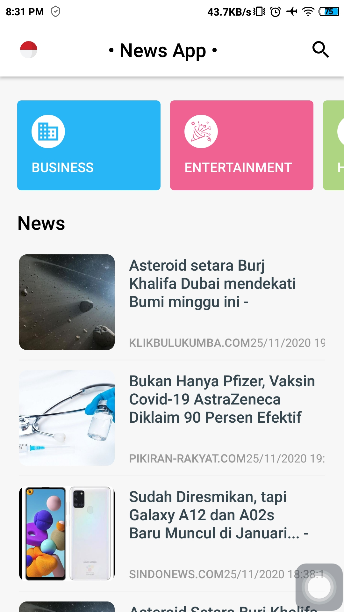

=
apply plugin: 'com.jakewharton.butterknife'

```

## Notes

### Add News Api
---
You need to create a [News API](https://newsapi.org/) key and add it to the strings.xml file

### Features
---
- different news categories.
- News search.
- News detail.
- Open the news source URL.

### Application Architecture
---
- IDE: Android Studio
- API: News API
- Arthitecture: MVVM
- Programming Language: Java
- Third Party Libraries: Retrofit, Glide, ButterKnife, Gson

<table style="width:100%">
  <tr>
    <th>Example 1</th>
    <th>Example 2</th>
  </tr>
  <tr>
    <td></td>
    <td></td>
  </tr>
  <tr>
    <th>Example 3</th>
    <th>Example 4</th>
  </tr>
  <tr>
    <td></td>

  </tr>
</table>

# License

```
